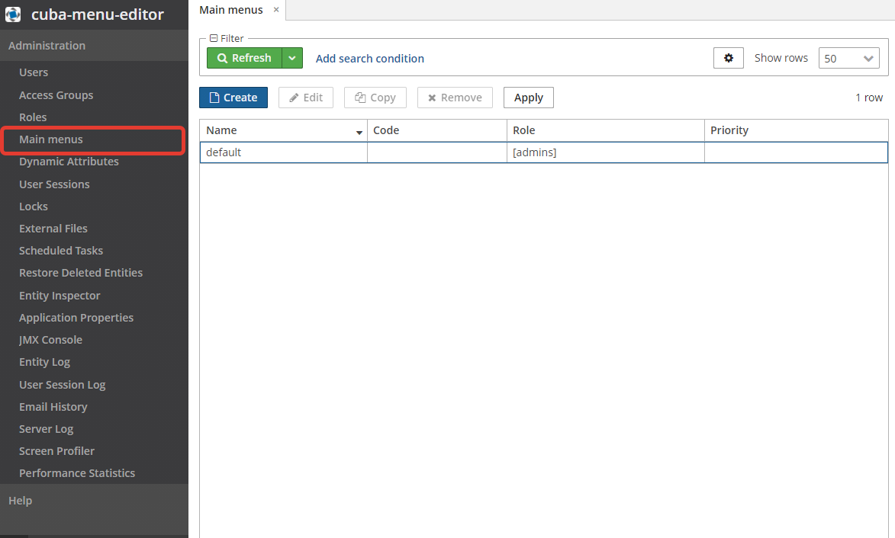
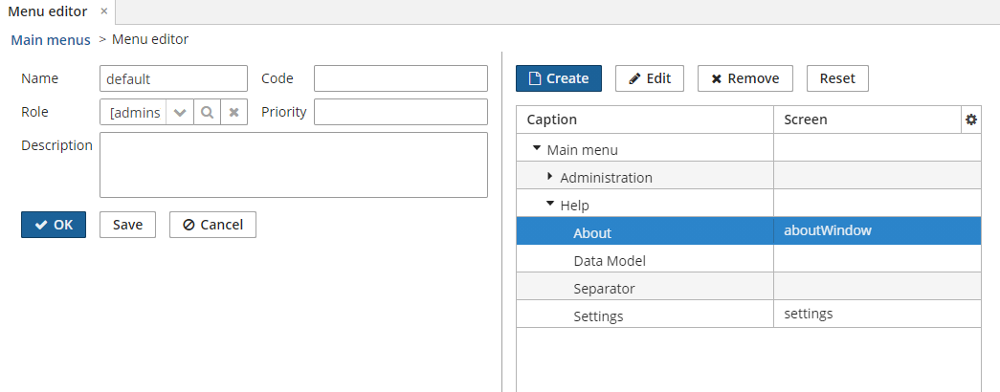
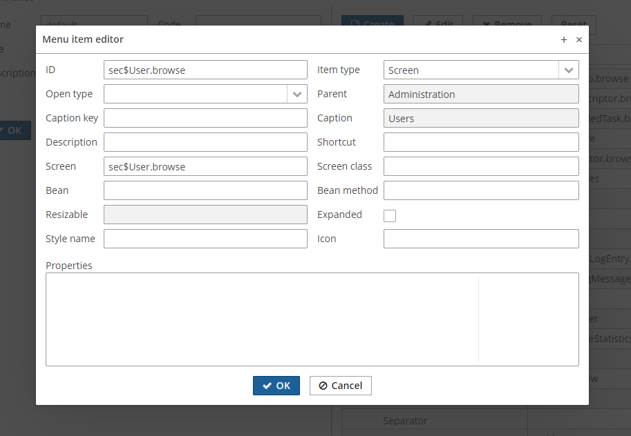

# cuba-menu-editor

## Overview
The add-on provides support of multiple main menus in CUBA applications. Menus are stored in DB and can be created 
and edited at runtime in administration screens.

## Installation
1. Add the following maven repository `'https://gitlab.com/api/v4/projects/24906229/packages/maven'` to build.gradle.
2. Install the add-on using the following coordinates `'ru.itsyn.cuba.menu_editor:menu-editor-global:<add-on version>'` 
   according [the platform documentation](https://doc.cuba-platform.com/manual-7.2/app_components_usage.html).
   
The latest version is: [0.7](https://gitlab.com/daring/it-syn-packages/-/packages/1544178)

## Usage
Menus can be created and edited in "Main menus" screen in Administration menu. Menu attributes (name, description, etc) and items can be changed in "Menu editor" screen. Items can be reordered
using Drang & Drop.

Reset action in "Menu editor" screen restores menu items from the default menu `web-menu.xml`.

The menu can be assigned to a user role using Role attribute. After that it is applied for all users 
that have this role. If multiple menus via different roles are applied to the user the menu with 
the highest priority is used.
